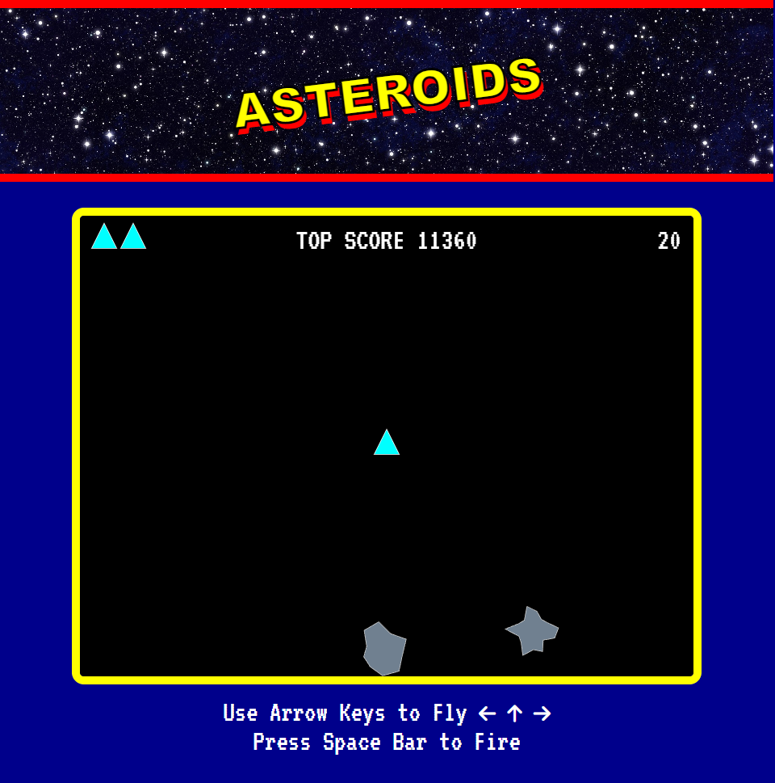

# [Asteroids](https://github.com/apatheticjedi/asteroids)

### Table of Contents

1. [Description](#description)
2. [Built With](#built-with)
3. [Installation](#installation)
4. [Usage](#usage)
5. [Contributing](#contributing)
7. [Questions](#questions)

## Description

[View the Deployed application here](https://apatheticjedi.github.io/asteroids/)

This is a version of Atari's 1979 arcade game, Asteroids. This game was written in JavaScript and utilizes the browser's local storage to save high scores. 

### Built With

* JavaScript
* HTML
* CSS 

## Installation

This game can be played in the browser by visiting the page [here](https://apatheticjedi.github.io/asteroids/). To install the application locally, clone this repo and open a server to host the page.

(<a href="#top">back to top</a>)

## Usage

To fly the ship forward, press the up arrow. To change the direction of the ship, use the left and right arrows. Fire the laser by pressing the space bar. The object of the game is to fly around the screen and destroy all the asteroids. Each asteroid will split into 2 smaller asteroids. Each of the smaller asteroids can be split into 2 smallest asteroids. Once all the smallest asteroids are destroyed, the game levels up by adding more starting asteroids and increasing their speed slightly. The player has 3 lives, displayed in the top left of the screen. Each time the ship collides with an asteroid, one life is lost. The player's score is displayed in the top right of the screen. High scores are saved in localStorage and are displayed at the top of the screen.

## Contributing

To contribute to this application, feel free to reach out to me below:

(<a href="#top">back to top</a>)

## Questions

Reach out to me with questions at:

[LinkedIn](https://www.linkedin.com/in/davidlundt/)

[GitHub](https://github.com/apatheticjedi)

(<a href="#top">back to top</a>)

